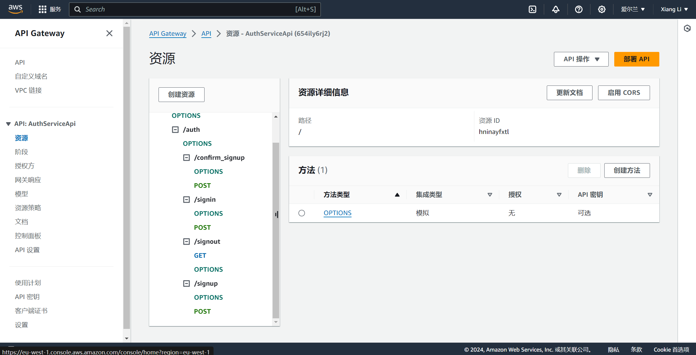
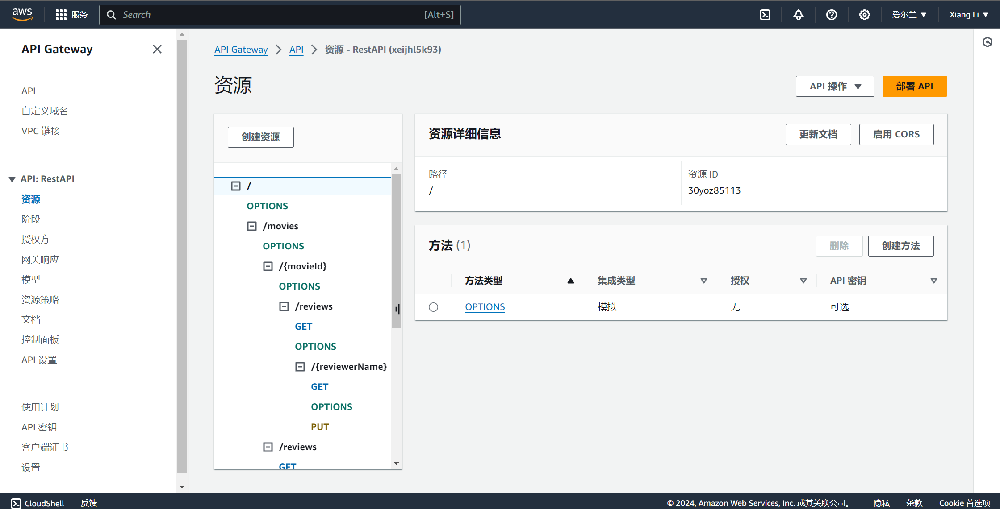
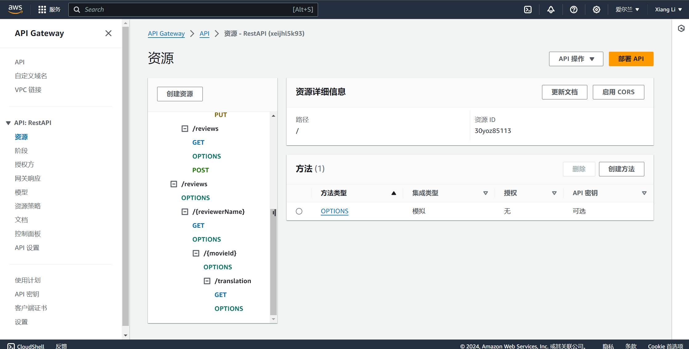
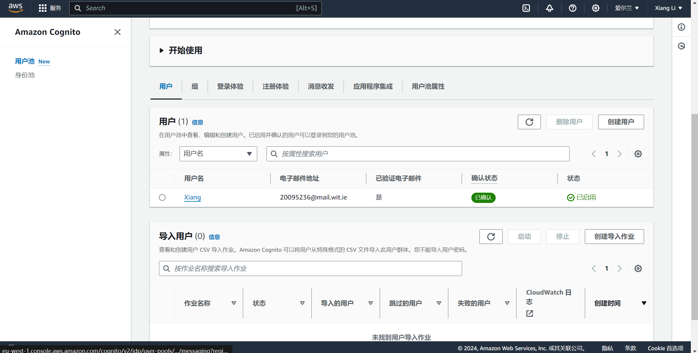
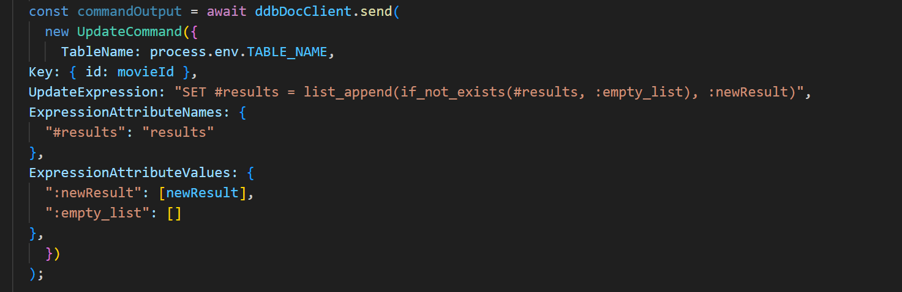
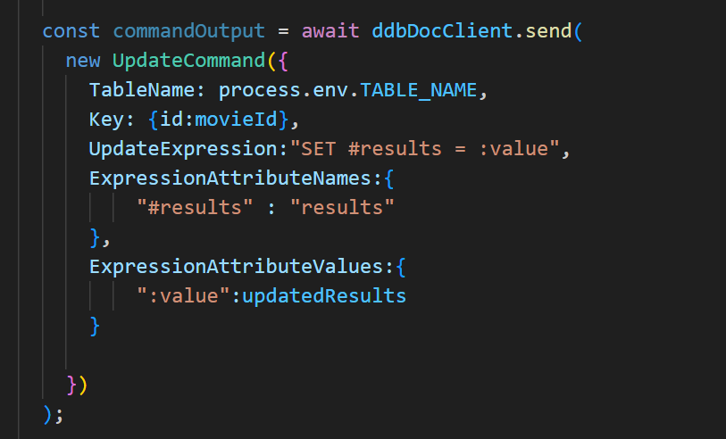
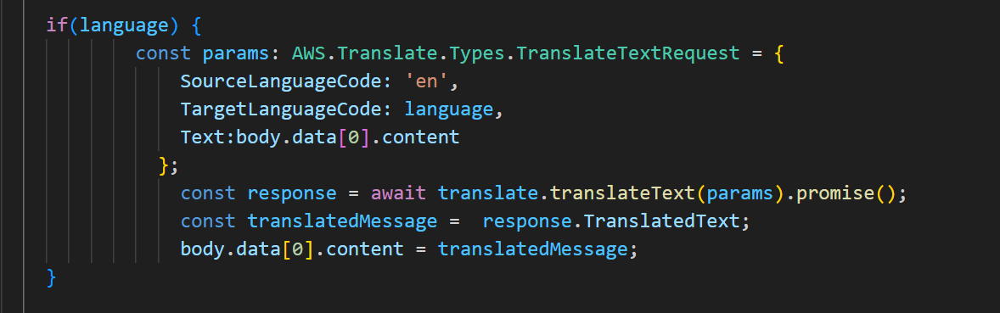
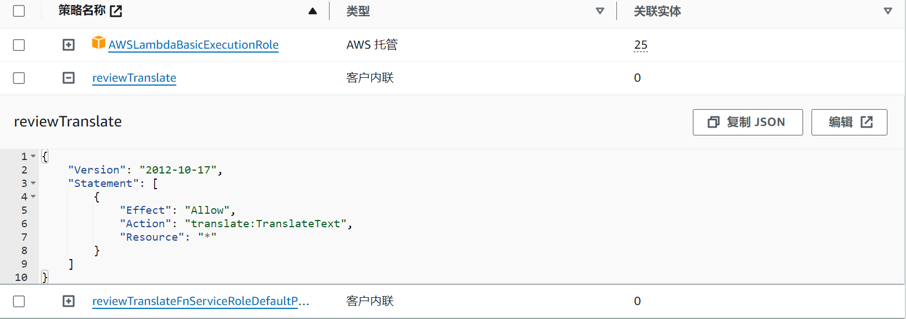

# Serverless REST Assignment

__Name:__ Xiang Li

__Video demonstration:__ <https://youtu.be/H4lVfpoAXiw>
This repository contains an implementation of a serverless REST API for the AWS platform. The CDK framework is used to provision its infrastructure. The API's domain context is movie reviews.

## API endpoints

+ POST /movies/reviews - add a movie review.
+ GET /movies/{movieId}/reviews - Get all the reviews for the specified movie.
+ GET /movies/{movieId}/reviews?minRating=n - Get the reviews for the specified movie with a rating greater than the minRating.
+ GET /movies/{movieId}/reviews/{reviewerName} - Get the review written by the named reviewer for the specified movie.
+ PUT /movies/{movieId}/reviews/{reviewerName} - Update the text of a review.
+ GET /movies/{movieId}/reviews?year=y - Get the reviews written in a specific year for a specific movie.
+ GET /reviews/{reviewerName} - Get all the reviews written by a specific reviewer.
+ GET /reviews/{reviewerName}/{movieId}/translation?language=code - Get a translated version of a movie review using the movie ID and reviewer name as the identifier.
+ POST /auth/signup - Register a new user account.
+ POST /auth/confirm_signup - Confirm the signup process.
+ GET /auth/signout - Sign out a user.
+ POST /auth/signin - Sign in a user.

## Authentication (if relevant)

## Independent learning (If relevant)

### UpdateCommand

I used the UpdateCommand function to implement the function of updating and inserting film reviews. I learnt the syntax associated with using the UpdateCommand function.
__Related documents__: pudateReview.ts, addMovieReview.ts.

### Amazon Translate

I learned and implemented how to use Amazon Translate to translate a review of a film into a specified language. Learned the rules for writing Amazon Translate and configuring user permissions accordingly.
__Related documents__: translateReview.ts

